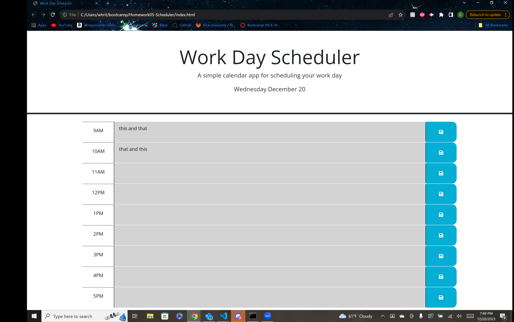

## Homework05-Scheduler

## Description

Create a simple calendar application that allows a user to save events for each hour of a typical working day (9am–5pm). This app will run in the browser and feature dynamically updated HTML and CSS powered by jQuery.


## User Story

```
AS AN employee with a busy schedule
I WANT to add important events to a daily planner
SO THAT I can manage my time effectively
```

## Acceptance Criteria

```
GIVEN I am using a daily planner to create a schedule
WHEN I open the planner
THEN the current day is displayed at the top of the calendar
WHEN I scroll down
THEN I am presented with time blocks for standard business hours of 9am to 5pm
WHEN I view the time blocks for that day
THEN each time block is color-coded to indicate whether it is in the past, present, or future
WHEN I click into a time block
THEN I can enter an event
WHEN I click the save button for that time block
THEN the text for that event is saved in local storage
WHEN I refresh the page
THEN the saved events persist
```

## Features Added

```
Created a dynamic formating method for each hour segment
Created a dynamic colorizing system for each text area based on its relativity to the current time
Created a system that saves data typed into each segment after you press the respective save button
Added functionality to show previously saved text for each segment when you load up the page
```

## Screenshots

The following image shows the web application's appearance and functionality:




## Credits

Myself Cameron Whritenour https://github.com/camwhritenour

## Link to Website

https://camwhritenour.github.io/Homework05-Scheduler
